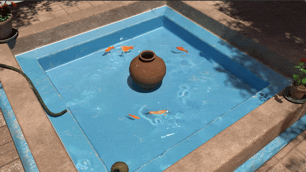
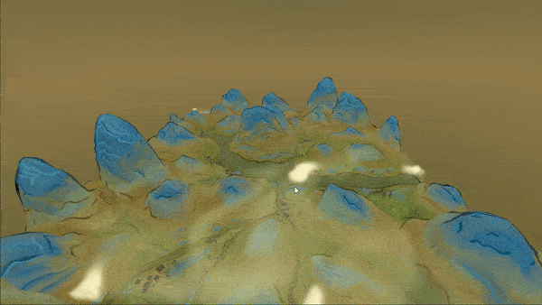
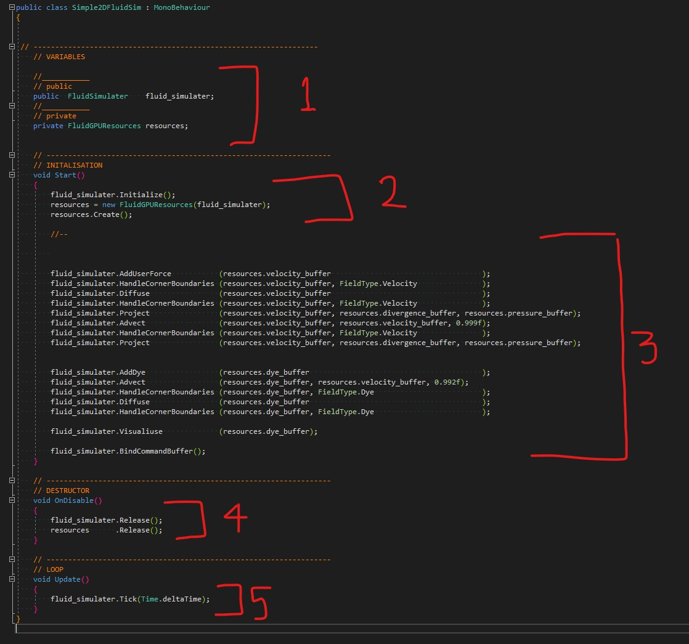

Fluid Simulation Implemented in Compute shaders in Unity 3D
=================
This repo contains code for a fluid simulation pipeline implmented in Compute shaders. The code has been tested on Unity 2019.1.14f1 Windows DX11, with the Legacy renderer. 

You can read the full explaination of the technique on my blog: [Gentle Introduction to Fluid Simulation for Programmers and Technical Artists](https://medium.com/@shahriyarshahrabi/gentle-introduction-to-fluid-simulation-for-programmers-and-technical-artists-7c0045c40bac)

The Second demo scene is The Vast Land, where I use the fluid simulation for stylized fog. You can read the break down of that on my blog: [Interactive Volumetric Fog With Fluid Dynamics and Arbitrary Boundaries](interactive-volumetric-fog-with-fluid-dynamics-and-arbitrary-boundaries-f82fdee86397)

--------------------------

To get started with the repo, select any of the 3 demo scenes, under Assets/Scenes. The three scenes are:
1. **2DFluid**: this is a simple 2D fluid setup, with the left click you can add dye to the screen, and while holding the right click and moving your mouse you can apply force the system.  
2. **2DFluid Arbitary Boundary**: Just like the one above, but there is a constant stream of dye input+force, and boundaries in the middle of the simulation grid
3. **Persian Garden Demo**: This is the level you can see in the gif, it holds a *fake* 3D fluid simulation, where a 2D simulation is mapped on a 3D plane. You can't add dye in this scene, with left click you can apply force and manipulate the pool and while holding the left click you can fly around the scene with the WSAD or the arrows and zoom, up down with E and Q and finally change fov with the middle scroll. 

Each of these scenes has a Manager Game object and a Manager script on it. Viewing this script in your code editor, you can see examples of how to properly initialize the fluid simulator engine and call its various functions. 

I suggest looking at the 2D Fluid scene first, since it has the simplest implementation. From there if you wish to know about the implementation of each step, you can jump to the defination of any of the functions (diffuse for example) and see how it is implemented.

------------------
Fluid Engine: Use
=================

The general Architecture of the engine is as follows: it has a **Fluid Simulator** class, which you need to properly initialize before use, and deintialize before you switch out of the scene or close the game, and **Fluid GPU Resrouce** class, where you need to do the same.
Once you have the initialization behind you, you can build a pipeline, where you call the different steps of the fluid simulation, on various fields such as velocity, dye, temperature etc. A very simple example from the 2DFluid Demo Scene looks like this: 

Base on this code you can see that you need these 5 sections: 
1. You need to declare your Fluid Simulator class as a public memeber, through these you can set all the control paramaters as well as (**Make sure this is set**) all the references to the various compute shaders in the project
2. Initializasion, do this somewhere like begin play/ Start
3. Pipeline Building, you can configure this to your need, for example I am calling Project several times at the cost of performance, but you can call it only once. Also beside this dye you can use several dye textures etc, or none, or another field. 
4. The GPU resources need to be released so make sure you call these 
5. The Tick function sets all the relevant paramters (such as mouse position etc) in the update. Call this in your update or as regural as you want your simulation updated

For more information, read through the Fluid Simulator class, most things are commented there, even more info are in the Shader files, where the operations are explained. If you are missing the baisic idea of Fluid Simulation, make sure to read my blog post linked above first. 

Fluid Engine: Adding New Things and Architecture
=================

